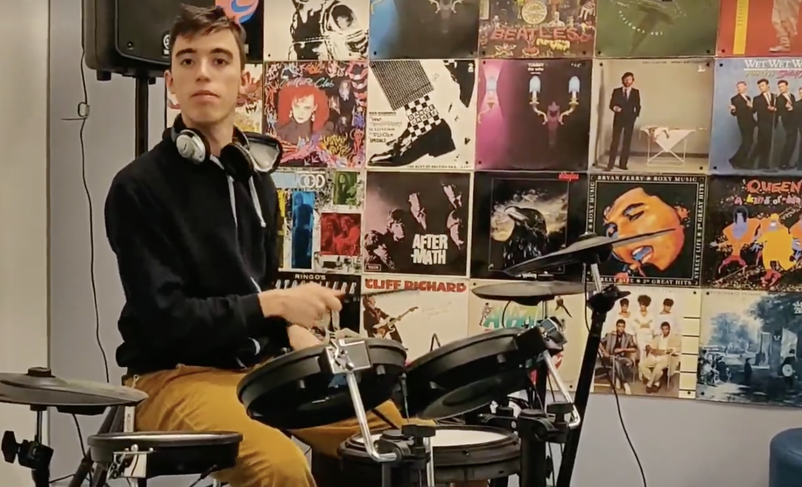

Growing up I thought I would play piano as a profession. Things ended up differently, but I kept exploring different styles and instruments over the year.

### Classical Piano 

I spent the first ten years of my musical career with a standard classical piano education, since the age of 8.

This recording  is from the Yamaha Asia Music Scholarship 2017 competition held in Shanghai, where I performed [**Chopin, Étude Op. 25, No. 12**](https://www.youtube.com/watch?v=N9mai0tAhoM) that got me a second place.

Some of my other public recordings include
- [Liszt's Liebestraum No. 3](https://www.youtube.com/watch?v=isHg7HIr8iE)
- [Chopin – Fantaisie-Impromptu, Op. 66](https://www.youtube.com/watch?v=LHUGcYSRpCg)

### Jazz Piano

At 16 I turned to jazz studying under Aldo Radaelli, a local jazz player from Milano.

My style follows the classic jazz from the 1950's, with my references being [Bill Evans](https://en.wikipedia.org/wiki/Bill_Evans) and [Miles Davis](https://en.wikipedia.org/wiki/Miles_Davis). One example is a recording of my **[arrangment of Autumn Leaves](https://en.wikipedia.org/wiki/Miles_Davis)**.

I also recorded some **[duos with the drummer Mario Solbiati](https://www.youtube.com/watch?v=WVyHBiUyf6w)**, also my grandfather.

### Violin

I couldn't always bring a piano along with me, so I bought a violin and started studying.

Beside some [traditional violin recording](https://www.youtube.com/watch?v=LfKax1cnYYs), you can also watch me [playing violin on the street](https://www.youtube.com/watch?v=zQTD2dyyFoE), cause why should I do my violin exercise at home when I can do them *en plein air*.

### Drums

My current company had a music room with drums so after 6 months there I picked up jazz drumming pretty eagerly.

I enjoy playing [odd tempos](https://en.wikipedia.org/wiki/List_of_musical_works_in_unusual_time_signatures#Upper_number_of_5) like [Take Five from Dave Brubeck](https://en.wikipedia.org/wiki/Take_Five). I am planning to make some recording of [classical drumming](https://www.youtube.com/watch?v=Q8IU96AMbmo) in the next future.

