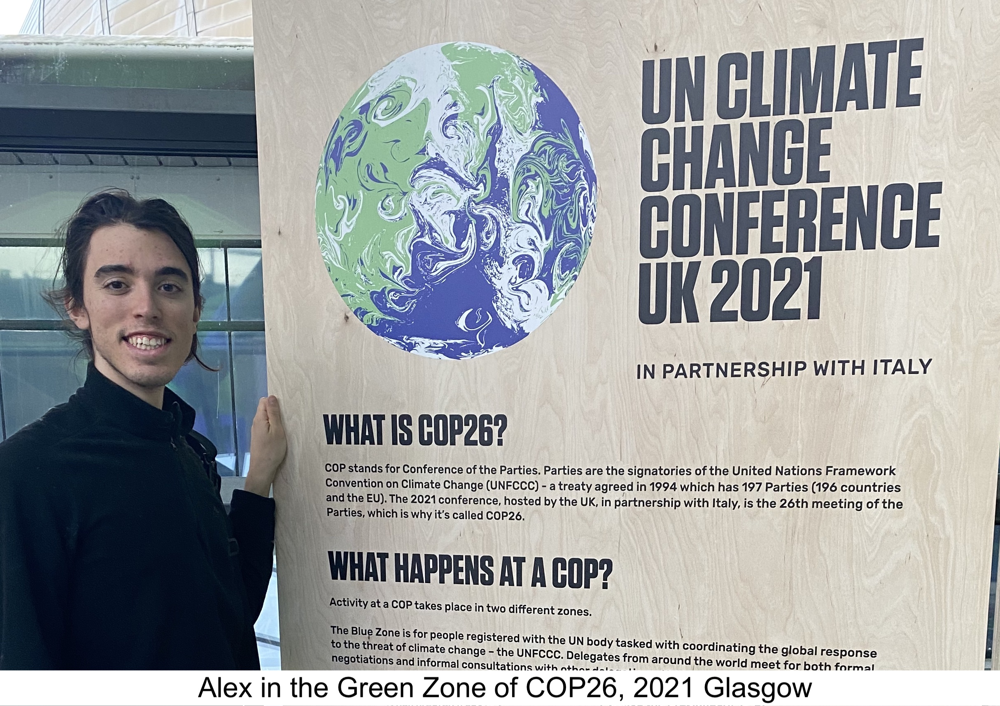
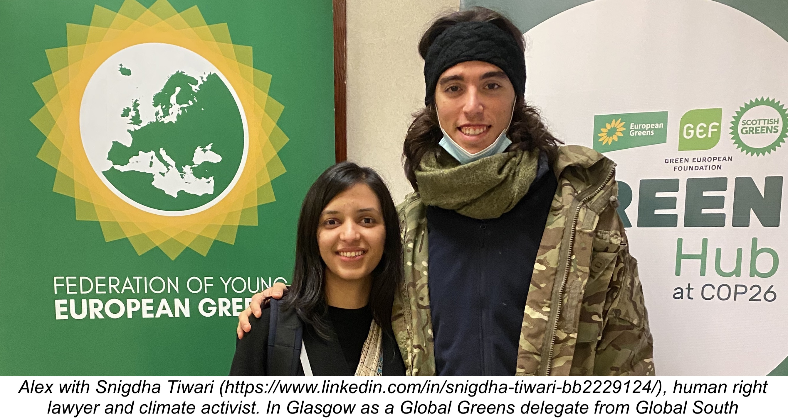

I didn't know anyone, still booked an Airbnb in Glasgow for COP26 and followed people around to see what's going on with climate change. 
I learned a lot and made a lot of friends outside my normal information bubble. 

## My 2 cents on Climate Change

- **Climate Change is happening right now**. Not in 2050, not in 2030 but in 2021. I met Snigdha from India, her city was swept away by melting glaciers. I met Maria from Mozambico, she didn't have running water in the house for the last two years and she washed herself with goat milk. These are not naturally occuring phenomenons (fact checked by Alex)

- **Humanity does not yet have any feasible solution to global warming (as of 2021)**. Earth is going to keep warming, and is going to look unrecognisable in decades time.

- **Climate change is not inherently bad, what's bad is that a lot people are going to die cause they can't adapt**. The impact is going to be order of magnitudes bigger than COVID19, both for developed and developing countries.

- **Climate Adaptation is going to become the main narrative of the 21st century** and also a trillion dollary industry in the next decade.

## Type of humans at COP26 (sorted by count)

### The Activist
Aged 16-30, energetic, angry, disillusioned. Tells you about climate change science, moves solid critiques to current policies, but doesn't generally propose solutions. When asked about solutions, the activist often reply "that's for the politician to figure out".

### The Politician
Aged 40+, articulate, worried, optimist. Generally well intended to make positive changes, faced by really hard tradeoffs. The proposed changes are obviously not adequate to solve the problem. When asked about more ambitious solutions, the politician often reply "I don't have all the answers".

### The Big Corp (inc)
Aged 30-50, formulaic, smiling, satisfied. Most times well intended to make positive changes, but indulges too much into PR stunts and self-celebrations to be taken seriously. According to The Big Corp (inc) everything is going great, when asked hard questions (e.g. why should I use hydrogen instead of batteries) often reply "I am going to come back to you on that".

### The Academic
Aged 50+, direct, detached, well-informed. Explains you climate science in great detail, not always easy to follow, proposes a lot of "obvious" solutions. The solutions are often impractical like "stop all air travel and maritime shipping in the next 5 years". When asked how to implement these solutions reply "that's a political problem".

### The Entrepreneur
Various ages, passionate, busy, confident. Speaks to you about solutions, most of them more or less convincing if you agree with the assumptions. Generally over estimates current technologies, and has strong opinions on where technology will go (e.g Carbon Capture). When criticized of "technological optimism", The Entrepreneur doesn't generally answer to the critiques (and doesn't come at COP26 all together).

## Some Hard Questions

### Should you cut your personal emissions? 
Yes if it doesn't feel like a sacrifice. The first-order consequences of reducing your personal CO2 emissions are absolutely negligible, but the second-order consequences might be worthwhile, both as influence on others and influence on yourself. Critising someone for not cutting their own emissions (and still advocate for climate change) is generally not a solid argument.

### Do we need climate justice to fix climate change?
Yes, Kenya energy is 95% renewable, and they are responsible for 0.1% of global emissions. It's also going to be one of the most affected country by climate change (drought and floods) because of their geographical features. To reduce the social impact of global warming, wealth should be redistributed according to climate impact and emissions. Without climate justice, climate change is going to kill significantly more people.

### How do we fix global warming?
Humans are not good at fixing problems like global warming. Society as a whole shows really poor planning skills, especially in face of analytical evidence (e.g. COVID19). We are talking monkeys with electrical toys, and we follow our gut feeling. On the other hand we are really good at survival and adaptation. I expect humanity to underperform in preventing global warming, but overperforming at adapting to it.

### Ok so we can't fix global warming?
My ordered permutation of choice from the solution space to global warming would be
- nuclear fusion
- 100% electric battery-powered transportation 
- heavy industries (steel, cement) in space
- 100% plant based diet
Hey, but I am also just a talking monkey driven by gut feeling!

peed & Scale. The book reads like a techno-optimist’s action plan for solving climate change - because it is. 
